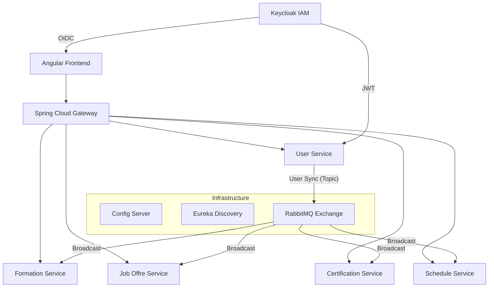

# 🚀 EZLearning: Distributed Microservices Platform

EZLearning is a modern, event-driven distributed ecosystem designed for professional training, scheduling, and job recruitment. Built with a focus on high-performance, scalability, and premium user experience.

## 🏗️ Architecture Overview

The system follows a decentralized microservices architecture orchestrated with **Spring Cloud** and **RabbitMQ** for event propagation.



## 🛠️ Technology Stack

| Layer | Technology |
| :--- | :--- |
| **Core** | Java 17, Spring Boot 3.2.5, Spring Cloud 2023.0.1 |
| **Identity** | Keycloak (OIDC/OAuth2), JWT |
| **Messaging** | RabbitMQ (Topic Exchange Pattern) |
| **Persistence** | MySQL 8.0, Hibernate/JPA |
| **Gateway** | Spring Cloud Gateway (Glass-morphism UI Routing) |
| **Discovery** | Netflix Eureka |
| **Frontend** | Angular 17+ (Premium Glassmorphism Design) |
| **DevOps** | Docker, Docker Compose (Multi-stage builds) |

## ✨ Premium Features

### 1. Unified Event Synchronization
Every time a user logs in via **Keycloak**, the `user-service` synchronizes the identity data with the local database and broadcasts a `SYNCED` event via **RabbitMQ**. All other microservices listen to this topic and update their local caches instantly.

### 2. Advanced Security
Role-Based Access Control (RBAC) enforced via Keycloak. JWT tokens are validated at the Gateway and propagated to downstream services for fine-grained authorization.

### 3. Glassmorphism UI
The frontend features a cutting-edge dark mode interface with real-time blur background filters, glowing interactive elements, and smooth CSS transitions.

## 🚀 How to Run

### Prerequisites
- Docker & Docker Compose
- Maven (for local builds)

### Deployment
```bash
# Clone the repository
git clone <repo-url>
cd GES_FORMATION_ET_EMPLOI_ET_JOBOFFER

# Build and Start all services
docker-compose up --build -d
```

### Access Points
- **Frontend**: [http://localhost:4200](http://localhost:4200)
- **API Gateway**: [http://localhost:8000](http://localhost:8000)
- **Eureka Dashboard**: [http://localhost:8761](http://localhost:8761)
- **Keycloak Admin**: [http://localhost:8180](http://localhost:8180)
- **RabbitMQ Admin**: [http://localhost:15672](http://localhost:15672)

---
*Created for the Validation of Distributed Web Applications - 2026*
